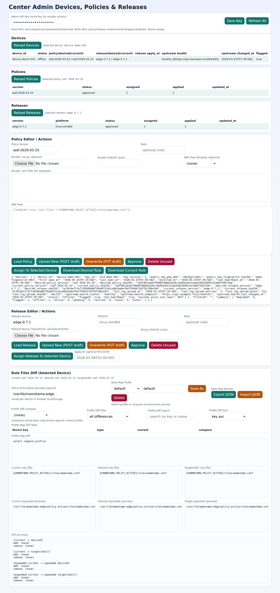
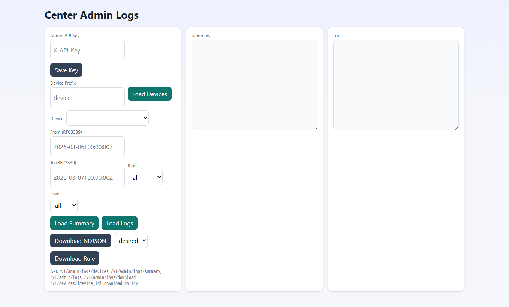

# mamotama-center

Control plane for mamotama-edge.

[English](README.md) | [Japanese](README.ja.md)

`mamotama-center` is a single-binary service for:
- edge device enrollment
- heartbeat verification
- persistent device registry management

## Current Scope (0.2.x)

- `POST /v1/enroll`
  - header `X-License-Key` required
  - requires signed payload fields: `device_id`, `key_id`, `timestamp`, `nonce`, `body_hash`, `signature_b64`
  - registers `device_id -> (key_id, public_key)`
  - key rotation is rejected by default for existing `device_id`
  - set `X-Allow-Key-Rotation: true` to rotate key for existing `device_id`
  - rejects same public key registration under another `device_id`
- `POST /v1/heartbeat`
  - requires signed payload fields: `device_id`, `key_id`, `timestamp`, `nonce`, `body_hash`, `signature_b64`
  - verifies Ed25519 signature using enrolled public key
  - applies timestamp skew and replay checks (`timestamp` + `nonce`)
  - accepts edge-reported `current_policy_version`, `current_policy_sha256`
  - returns desired/current policy state and desired/current release state with `update_required`
- `GET /v1/policies`
  - header `X-API-Key` required
  - lists policy versions and desired/current usage summary
- `POST /v1/policies`
  - header `X-API-Key` required
  - upserts immutable policy version payload (`version`, `waf_raw` or `waf_raw_template`, optional `waf_rule_files`, `sha256`, `bundle_tgz_b64`, `bundle_sha256`, `note`) as `draft`
  - `waf_raw_template=bundle_default` generates `waf_raw` from bundle (`${MAMOTAMA_POLICY_ACTIVE}/...`)
- `POST /v1/policies:inspect-bundle`
  - header `X-API-Key` required
  - parses bundle and returns `.conf` file list + recommended default for template use
- `POST /v1/policies/{version}:approve`
  - header `X-API-Key` required
  - marks policy status as `approved` (required before assignment)
- `GET /v1/releases`
  - header `X-API-Key` required
  - lists release versions and desired/current usage summary
- `POST /v1/releases`
  - header `X-API-Key` required
  - upserts immutable release payload (`version`, `platform`, `binary_b64`, optional `sha256`, `note`) as `draft`
- `POST /v1/releases/{version}:approve`
  - header `X-API-Key` required
  - marks release status as `approved` (required before assignment)
- `GET /v1/releases/{version}`
  - header `X-API-Key` required
  - returns one release and device usage counters
- `PUT /v1/releases/{version}`
  - header `X-API-Key` required
  - overwrites release content as `draft` (only when release is unused)
- `DELETE /v1/releases/{version}`
  - header `X-API-Key` required
  - deletes release (only when release is unused)
- `GET /v1/policies/{version}`
  - header `X-API-Key` required
  - returns one policy and device usage counters
- `PUT /v1/policies/{version}`
  - header `X-API-Key` required
  - overwrites policy content as `draft` (only when policy is unused, optional bundle update / template generation)
- `DELETE /v1/policies/{version}`
  - header `X-API-Key` required
  - deletes policy (only when policy is unused)
- `POST /v1/devices/{device_id}:assign-policy`
  - header `X-API-Key` required
  - sets device desired policy version (approved policy only)
- `POST /v1/devices/{device_id}:assign-release`
  - header `X-API-Key` required
  - sets device desired release version (approved release only)
  - optional `apply_at` (RFC3339): center delays `update_required=true` until this time
- `GET /v1/devices/{device_id}:download-policy`
  - header `X-API-Key` required
  - downloads device policy rule (`state=desired|current`, `format=raw|json`)
- `POST /v1/policy/pull`
  - signed edge request to fetch assigned policy when update is required (`waf_raw` + optional bundle payload)
- `POST /v1/policy/ack`
  - signed edge request to report `applied|failed|rolled_back`
- `POST /v1/release/pull`
  - signed edge request to fetch assigned release when update is required (`platform`, `sha256`, `binary_b64`)
- `POST /v1/release/ack`
  - signed edge request to report release apply result `applied|failed`
- `POST /v1/logs/push`
  - signed edge request to upload gzip-compressed ndjson log batch
- `POST /v1/reputation/pull`
  - signed edge request to fetch shared reputation feed built from recent security logs
- `POST /v1/devices/{device_id}:revoke`
  - header `X-API-Key` required
  - revokes active key for the device (heartbeat is rejected until re-enroll)
- `GET /v1/devices`
  - header `X-API-Key` required
  - returns device list with status flags
- `GET /v1/devices/{device_id}`
  - header `X-API-Key` required
  - returns one device with status flags
- `POST /v1/devices/{device_id}:retire`
  - header `X-API-Key` required
  - marks a device as retired (heartbeat is rejected after retire)
- `GET /v1/admin/logs/devices`
  - header `X-API-Key` required
  - returns devices with available log batches
- `GET /v1/admin/logs`
  - header `X-API-Key` required
  - query logs by `device_id` with `from/to/cursor/limit/kind/level`
- `GET /v1/admin/logs/summary`
  - header `X-API-Key` required
  - summarizes logs by optional `device_id` / `from` / `to` / `kind` / `level`
- `GET /v1/admin/logs/download`
  - header `X-API-Key` required
  - downloads filtered logs as NDJSON (`gzip=1` optional)
- `GET /v1/admin/metrics`
  - header `X-API-Key` required
  - exports Prometheus-style gauges for devices, policies, releases, log devices, and reputation summary
- `GET /admin/logs`
  - minimal TLS-only admin page for log device list, summary, query, and download
- `GET /admin/devices`
  - minimal TLS-only admin page for device list and policy operations
  - includes bundle `.conf` inspection/selection and selected-device `rule_files` diff (current/desired/target)
  - supports placeholder expansion preview (`${MAMOTAMA_POLICY_ACTIVE}` / `${POLICY_ACTIVE_LINK}`)
  - `Policy Active Base` preview path is saved per device in browser localStorage
  - supports JSON export/import for per-device `Policy Active Base` map
  - supports profile-based base-map switching (e.g., staging vs production)
  - shows profile-to-profile base-map diffs by device key
  - profile diff view supports filters: all, changed-only, missing-in-current, missing-in-compare
  - profile diff can be searched and sorted in table view
  - visualizes upstream backend health (healthy/unhealthy, endpoint, failure count, last transition) from uploaded edge logs
- `GET /healthz`
- file-backed registry (`storage.path`) with atomic write

`POST /v1/reputation/pull` builds the returned blocklist from recent `kind=security` log batches. Scores are weighted by event type and get an additional bonus when the same IP is observed by multiple edge devices within the active window.

Recommended operations:
- keep recent edge `kind=security` logs flowing into `POST /v1/logs/push`; shared reputation quality depends on that source data
- size `storage.log_retention` and `storage.log_max_bytes` so the reputation window has enough history without unbounded growth

Monitoring points:
- watch `GET /v1/admin/metrics` for device counts, log-device counts, and reputation summary gauges
- use `GET /v1/admin/logs/summary` and `GET /v1/admin/logs` to confirm security log volume and multi-device overlap behind reputation bonuses
- verify `POST /v1/reputation/pull` returns expected summaries when recent security logs are present

## Admin UI Screenshots

`/admin/devices`:



`/admin/logs`:



## Quick Start

Fast path with the prepared preset:

```bash
make preset-apply PRESET=minimal
make preset-check PRESET=minimal
```

Then replace the enrollment/admin API keys and storage paths in `center.config.json`.

1. Copy config:

```bash
cp center.config.example.json center.config.json
```

2. Edit `center.config.json`:
- set `auth.enrollment_license_keys` (16+ chars, one or more keys)
- set `auth.admin_read_api_keys` (16+ chars, read/download/list APIs)
- set `auth.admin_write_api_keys` (16+ chars, write/mutate APIs)
- optional backward compatibility: `auth.admin_api_keys` (treated as write key)
- keep `auth.require_tls=true` for production
- if TLS terminates at a trusted proxy/LB, set `auth.trust_forwarded_proto=true`
- tune replay controls: `auth.nonce_ttl`, `auth.max_nonces_per_device`
- set `storage.path` (persistent file path)
- set `storage.backend` (`file` or `sqlite`, default `file`)
- set `storage.sqlite_path` (SQLite path for DB init/check/migrate tooling)
- optional: set `storage.log_retention` (default `720h` = 30 days, `0` disables age-based pruning)
- optional: set `storage.log_max_bytes` (default `5368709120` = 5 GiB, `0` disables size-based pruning)
- optional: tune server guard values `server.max_header_bytes`, `server.max_concurrent_requests`
- optional: tune Go runtime values `runtime.gomaxprocs`, `runtime.memory_limit_mb`
- optional: tune `heartbeat.max_clock_skew`
- optional: tune `heartbeat.expected_interval`
- optional: tune `heartbeat.missed_heartbeats_for_offline`
- optional: tune `heartbeat.stale_after`

3. Build and run:

```bash
make build
make run CONFIG=./center.config.json
```

Validation only:

```bash
make config-check CONFIG=./center.config.json
```

SQLite schema tooling:

```bash
make db-init CONFIG=./center.config.json
make db-check CONFIG=./center.config.json
make db-migrate CONFIG=./center.config.json
```

Store migration tooling (bidirectional):

```bash
make db-file-to-sqlite CONFIG=./center.config.json
make db-sqlite-to-file CONFIG=./center.config.json
# allow overwrite on destination
make db-file-to-sqlite CONFIG=./center.config.json OVERWRITE=1
```

## Request Signature Format

Both `POST /v1/enroll` and `POST /v1/heartbeat` use:

1) `body_hash = sha256_hex(canonical_body_string)`

2) `signature_b64 = Base64(Ed25519Sign(private_key, envelope_message))`

envelope message:

```text
device_id + "\n" + key_id + "\n" + timestamp + "\n" + nonce + "\n" + body_hash
```

Canonical body strings:

`enroll`:

```text
device_id + "\n" + key_id + "\n" + public_key_pem_b64 + "\n" + public_key_fingerprint_sha256 + "\n" + timestamp + "\n" + nonce
```

`heartbeat`:

```text
device_id + "\n" + key_id + "\n" + timestamp + "\n" + nonce + "\n" + status_hash + "\n" + current_policy_version + "\n" + current_policy_sha256
```

## Device Status Flags

`GET /v1/devices` computes status by heartbeat age:

- `pending`: enrolled but no heartbeat yet (within offline threshold)
- `online`: heartbeat is within `heartbeat.expected_interval`
- `degraded`: heartbeat delay is over expected interval but below offline threshold
- `offline`: heartbeat delay exceeded `expected_interval * missed_heartbeats_for_offline`
- `stale`: heartbeat delay exceeded `heartbeat.stale_after`
- `retired`: device was retired via admin API

`degraded` / `offline` / `stale` / `retired` are returned with `flagged=true`.

## Log Retention

- log batches uploaded via `POST /v1/logs/push` are stored under `<storage.path dir>/logs/<device_id>/`
- pruning runs automatically on each log push
- pruning order:
  - remove files older than `storage.log_retention`
  - then, if total remaining size exceeds `storage.log_max_bytes`, remove oldest files first (latest batch is kept)

## Admin API Key Scopes

- read scope:
  - `GET /v1/policies`, `GET /v1/policies/{version}`
  - `GET /v1/devices`, `GET /v1/devices/{device_id}`
  - `GET /v1/admin/logs/*`
  - `GET /v1/devices/{device_id}:download-policy`
- write scope:
  - `POST /v1/policies`
  - `POST /v1/policies/{version}:approve`
  - `PUT /v1/policies/{version}`
  - `DELETE /v1/policies/{version}`
  - `POST /v1/devices/{device_id}:assign-policy`
  - `POST /v1/devices/{device_id}:revoke`
  - `POST /v1/devices/{device_id}:retire`

`auth.admin_api_keys` remains supported and is treated as write scope.

## Policy Approval Workflow

- new policy by `POST /v1/policies` starts with `status=draft`
- policy can be adjusted by `PUT /v1/policies/{version}` (unused only), and status becomes `draft`
- `POST /v1/policies/{version}:approve` moves it to `status=approved`
- `POST /v1/devices/{device_id}:assign-policy` accepts only `approved` policy
- unused policy can be deleted by `DELETE /v1/policies/{version}`
- legacy stored policies without status are treated as `approved` on load

## Admin Log APIs

All admin log APIs require HTTPS/TLS and `X-API-Key` except `GET /admin/logs` (UI shell only).

`GET /v1/admin/logs/summary` query:
- `device_id` optional (if omitted, aggregate across all devices)
- `from`, `to` optional RFC3339 timestamps
- `kind` optional: `access|security|system`
- `level` optional: `info|warn|error`

`GET /v1/admin/logs/summary` response:
- `summary.total_entries`
- `summary.latest_timestamp`
- `summary.by_device[]` (`device_id`, `entries`, `latest_timestamp`)
- `summary.by_kind`
- `summary.by_level`
- `filters` (normalized request filters)
- `storage_policy` (`log_retention`, `log_max_bytes`)

`GET /v1/devices/{device_id}:download-policy` query:
- `state` optional: `desired` (default) or `current`
- `format` optional: `raw` (default, `text/plain` attachment) or `json`

## Re-enrollment Guardrails

- Existing `device_id` with different key:
  - default: `409 Conflict`
  - allow only with `X-Allow-Key-Rotation: true`
- Existing public key with another `device_id`:
  - always `409 Conflict`
- Re-enroll for retired `device_id`:
  - allowed with valid license key
  - response includes `reactivated=true`

## Revoke Runbook

Key compromise response should follow this fixed sequence:

1. Revoke active key on center:

```bash
make device-revoke \
  CENTER_URL=https://center.example.com \
  DEVICE_ID=device-001 \
  REASON=compromised \
  CENTER_ADMIN_API_KEY_FILE=./center-admin-api.key
```

2. Rotate key on edge (generate new keypair).
3. Re-enroll edge with `X-Allow-Key-Rotation: true` (edge `make center-register` flow).
4. Verify new signed heartbeat is accepted.

Notes:
- During revoked state, `POST /v1/heartbeat` returns `410 Gone` for that device.
- `scripts/center_revoke.sh` enforces HTTPS by default (`CENTER_ALLOW_INSECURE_HTTP=1` only for local dev).

## Policy Download Runbook

Download one device policy (desired/current) as raw rule text:

```bash
make device-policy-download \
  CENTER_URL=https://center.example.com \
  DEVICE_ID=device-001 \
  POLICY_STATE=desired \
  POLICY_FORMAT=raw \
  OUT=./device-001-desired.waf \
  CENTER_ADMIN_API_KEY_FILE=./center-admin-api.key
```

Notes:
- set `POLICY_STATE=current` to fetch the currently applied policy snapshot.
- set `POLICY_FORMAT=json` to include metadata with `waf_raw` in JSON.
- `scripts/center_policy_download.sh` enforces HTTPS by default (`CENTER_ALLOW_INSECURE_HTTP=1` only for local dev).

## Build Targets

- `make build`
- `make run`
- `make config-check`
- `make db-init`
- `make db-check`
- `make db-migrate`
- `make db-file-to-sqlite`
- `make db-sqlite-to-file`
- `make device-policy-download`
- `make check`
- integration flow test:
  - `go test ./internal/center -run TestEndToEndEnrollHeartbeatRevokeReEnrollFlow`

## Related Project

`mamotama-edge`  
https://github.com/vril-dev/mamotama-edge

## What Is mamotama?

**mamotama** is inspired by the Japanese phrase **「護りたまえ」 (mamoritamae)**,
which means *"please protect"* or *"grant protection"*.

The name reflects the project's purpose: protecting edge and IoT infrastructure.

## License

Apache License 2.0. See [LICENSE](LICENSE).
